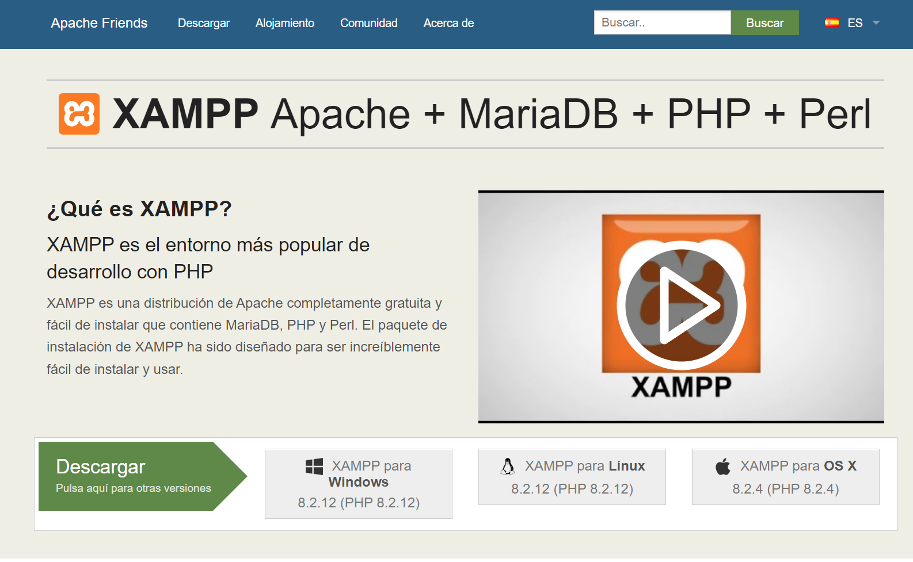
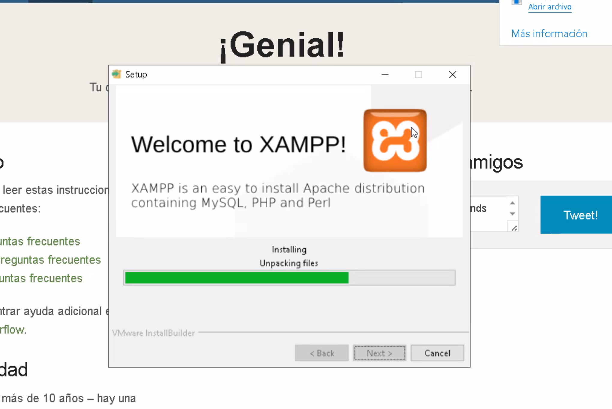

# Face-Server

El siguiente proyecto es un prototipo de servidor API RESTful que simula ser el servidor de una red social. Este servidor es capaz de recibir peticiones de usuarios y de publicaciones, y responder a estas peticiones con la información solicitada. Además, cuenta con un sistema de autenticación de usuarios y un sistema de almacenamiento de publicaciones.

## Inicialización de proyecto

Para inicializar el proyecto, se deben seguir los siguientes pasos:

1. Crear una carpeta en la que se almacenará el proyecto usando la terminal, además de ingresar a esta carpeta. Por ejemplo:

```bash
mkdir face-server
cd face-server
```

2. Initializar el proyecto con npm:

```bash
npm init -y
```
Con este comando se creará un archivo `package.json` con la configuración por defecto. El archivo `package.json` es el archivo de configuración de un proyecto de Node.js y se puede considerar como la hoja de vida del proyecto.

3. Instalar las dependencias necesarias para el proyecto:

```bash
npm install express body-parser cors
```

4. Crear una carpeta llamada `src` en la que se almacenarán los archivos del proyecto:

```bash
mkdir src
```
(También se puede crear la carpeta `src` manualmente en vs code)

5. Crear un archivo llamado `index.js` en la carpeta `src`:

```bash
touch src/index.js
```
(También se puede crear el archivo `index.js` manualmente en vs code)

6. Crear un archivo llamado `app.js` en la carpeta `src`:

```bash
touch src/app.js
```
(También se puede crear el archivo `app.js` manualmente en vs code)


## Primer servidor con Express

Para crear un servidor con Express, se deben seguir los siguientes pasos:

```javascript
// Import express
const express = require('express');

// Inicializo express y lo guardo en una constante llamada app
const app = express();

// Creo una ruta que responde con un mensaje de bienvenida
app.get('/', (req, res)=>{
    res.send('Bienvenido a mi API');
});

// Inicializo el servidor en el puerto 3000
app.listen( 3000, ()=>{
    console.log('Servidor iniciado en el puerto 3000');
});
```


## Solicitudes HTTP

Las solicitudes HTTP son peticiones que se realizan a un servidor para obtener o enviar información. Estas solicitudes se pueden realizar a través de diferentes métodos, como GET, POST, PUT, DELETE, entre otros. En el siguiente proyecto, se utilizarán los métodos GET y POST para realizar solicitudes a un servidor API RESTful.

### Método GET

El método GET se utiliza para solicitar información de un recurso en el servidor. Este método se puede utilizar para obtener información de un usuario, de una publicación, de un comentario, entre otros. Para realizar una solicitud GET a un servidor, se debe especificar la URL del recurso al que se quiere acceder.

Por ejemplo, cuando ingresamos a una página web, estamos realizando una solicitud GET al servidor que aloja la página web. En este caso, la URL del recurso es la dirección de la página web.


### Método POST

El método POST se utiliza para enviar información al servidor. Este método se puede utilizar para enviar información de un usuario, de una publicación, de un comentario, entre otros. Para realizar una solicitud POST a un servidor, se debe especificar la URL del recurso al que se quiere acceder y enviar la información que se quiere almacenar en el servidor.


## Creación de rutas

Para crear rutas en un servidor con Express, se deben seguir los siguientes pasos:

```javascript
// Import express
const express = require('express');

// Inicializo express y lo guardo en una constante llamada app
const app = express();

// Creo una ruta que responde con un mensaje de bienvenida
app.get('/', (req, res)=>{
    res.send('Bienvenido a mi API');
});

// Creamos una ruta que nos dee la fecha actual
app.get( '/fecha', (req, res) => {
    // Creo una variable que almacena la fecha actual
    let fecha = new Date();
    // Respondo con la fecha actual
    res.send( fecha );
})

// Crearemos una ruta de tipo POST que reciba un nombre y un apellido y responda con un mensaje de bienvenida con el nombre y apellido recibidos
app.post( '/saludo', (req, res)=>{

    

});

// Inicializo el servidor en el puerto 3000
app.listen( 3000, ()=>{
    console.log('Servidor iniciado en el puerto 3000');
});
```

### Anatomía de una ruta con Express

Una ruta en Express se compone de tres partes:

1. Método HTTP: El método HTTP que se utilizará para realizar la solicitud. Seguido de un punto, se especifica el método HTTP que se utilizará para acceder a la ruta. Por ejemplo, `app.get`, `app.post`, `app.put`, `app.delete`, entre otros.

2. URL: La URL del recurso al que se quiere acceder. Seguido de un paréntesis, se especifica la URL del recurso al que se quiere acceder. Por ejemplo, `'/fecha'`, `'/saludo'`, `'/usuarios'`, entre otros.

3. Función de respuesta: La función que se ejecutará cuando se realice la solicitud. Seguido de un paréntesis, se especifica la función que se ejecutará cuando se realice la solicitud. Esta función recibe dos parámetros, `req` y `res`, que representan la solicitud y la respuesta, respectivamente.


#### Función de respuesta o controlador

La función de respuesta o controlador es la función que se ejecutará cuando se realice la solicitud. Esta función recibe dos parámetros, `req` y `res`, que representan la solicitud y la respuesta, respectivamente. Dentro de esta función, se puede realizar cualquier tipo de operación, como enviar una respuesta, realizar una consulta a la base de datos, enviar una solicitud a otro servidor, entre otros.


## Patrón de diseño MVC

El patrón de diseño MVC (Modelo-Vista-Controlador) es un patrón de diseño que se utiliza para organizar el código de una aplicación. Este patrón de diseño se compone de tres partes:

1. Modelo: El modelo es la parte de la aplicación que se encarga de gestionar los datos y la lógica de negocio. En el caso de una aplicación web, el modelo se encarga de gestionar la información que se almacena en la base de datos y de realizar las operaciones necesarias para manipular esta información.
2. Vista: La vista es la parte de la aplicación que se encarga de mostrar la información al usuario. En el caso de una aplicación web, la vista se compone de las páginas web que se muestran al usuario. Para nuestro caso, haremos una API RESTful, por lo que no tendremos vistas. 
3. Controlador: El controlador es la parte de la aplicación que se encarga de gestionar las solicitudes del usuario y de enviar la información al modelo para que sea procesada. En el caso de una aplicación web, el controlador se encarga de recibir las solicitudes del usuario, de enviar la información al modelo para que sea procesada y de enviar la respuesta al usuario.
4. Rutas: Las rutas son la parte de la aplicación que se encarga de definir las URL a las que se puede acceder y de especificar las funciones que se ejecutarán cuando se realice una solicitud a estas URL. En el caso de una aplicación web, las rutas se encargan de definir las URL a las que se puede acceder y de especificar las funciones que se ejecutarán cuando se realice una solicitud a estas URL.


### Estructura de un proyecto con Express

La estructura de un proyecto con Express se compone de las siguientes carpetas y archivos:

1. Carpeta `src`: La carpeta `src` es la carpeta en la que se almacenan los archivos del proyecto. Esta carpeta se compone de las siguientes carpetas y archivos:
    - Carpeta `controllers`: La carpeta `controllers` es la carpeta en la que se almacenan los controladores de la aplicación. Los controladores son las funciones que se ejecutan cuando se realiza una solicitud a una URL. Por ejemplo, si se realiza una solicitud GET a la URL `/usuarios`, se ejecutará la función `getUsuarios` del controlador `usuariosController`.
    - Carpeta `models`: La carpeta `models` es la carpeta en la que se almacenan los modelos de la aplicación. Los modelos son las funciones que se encargan de gestionar los datos y la lógica de negocio. Por ejemplo, si se realiza una solicitud GET a la URL `/usuarios`, se ejecutará la función `getUsuarios` del modelo `usuariosModel`.
    - Carpeta `routes`: La carpeta `routes` es la carpeta en la que se almacenan las rutas de la aplicación. Las rutas son las URL a las que se puede acceder y las funciones que se ejecutarán cuando se realice una solicitud a estas URL. Por ejemplo, si se realiza una solicitud GET a la URL `/usuarios`, se ejecutará la función `getUsuarios` del controlador `usuariosController`.
    - Archivo `app.js`: El archivo `app.js` es el archivo en el que se inicializa el servidor de la aplicación. En este archivo se importan las rutas de la aplicación y se inicializa el servidor en un puerto específico.
    - Archivo `index.js`: El archivo `index.js` es el archivo en el que se importa el archivo `app.js` y se inicializa el servidor de la aplicación. Este archivo es el punto de entrada de la aplicación y se utiliza para inicializar el servidor de la aplicación.
  


### app.js y index.js

El archivo `app.js` es el archivo en el que se inicializa el servidor de la aplicación. En este archivo se importan las rutas de la aplicación y se inicializa el servidor en un puerto específico.

El archivo `index.js` es el archivo en el que se importa el archivo `app.js` y se inicializa el servidor de la aplicación. Este archivo es el punto de entrada de la aplicación y se utiliza para inicializar el servidor de la aplicación.

```javascript
const app = require('./app'); // Importo app desde app.js

// Inicializo el servidor en el puerto 3000
app.listen(3000, () => {
    console.log('Servidor corriendo en el puerto 3000');
});

```

### Rutear con Express

Para crear rutas en un servidor con Express, se deben seguir los siguientes pasos:

1. Crear un archivo en la carpeta `routes` con el nombre del recurso al que se quiere acceder. Por ejemplo, si se quiere acceder a la información de los usuarios, se debe crear un archivo llamado `usuarios.js` en la carpeta `routes`. En nuestro caso, vamos a crear un archivo llamado `auth.routes.js` en la carpeta `routes`.
2. Importar express y crear un router en el archivo creado. En nuestro caso, en el archivo `auth.routes.js` se debe importar express y crear un router con `express.Router()`.


`auth.routes.js`
```javascript
const { Router } = require("express"); // Importo la clase Router de express

const router = Router(); // Inicializo el router

// Defino mis rutas
router.post("/register", (req, res) => { // http://localhost:3000/api/auth/register
  console.log(req.body);
  return res.json({
    message: "Registro exitoso",
    data: req.body,
  });
});

router.post("/login", (req, res) => { // http://localhost:3000/api/auth/login
  console.log(req.body);
  return res.json({
    message: "Login exitoso",
    data: req.body,
  });
});

module.exports = router; // Exporto el router para poder usarlo en otros archivos
```

3. Importar el router en el archivo `app.js` y utilizarlo como middleware. En nuestro caso, en el archivo `app.js` se debe importar el archivo `auth.routes.js` y utilizarlo como middleware con `app.use('/api/auth', authRoutes);`.

`app.js`
```javascript
// Import express
const express = require('express');

// Inicializo express y lo guardo en una constante llamada app
const app = express();

app.use(express.json()); // Middleware que nos permite recibir datos en formato JSON

// Defino mis grupos de rutas
app.use('/api/auth', require('./routes/auth.routes')); // Rutas de autenticación

module.exports = app; // Exporto app para poder usarlo en otros archivos

```


## Base de datos con XAMPP

XAMPP es un paquete de software libre, que consiste principalmente en el sistema de gestión de bases de datos MySQL, el servidor web Apache y los intérpretes para lenguajes de script PHP y Perl. El nombre proviene del acrónimo de X (para cualquiera de los diferentes sistemas operativos), Apache, MySQL, PHP, Perl.

Para instalar XAMPP, se deben seguir los siguientes pasos:

1. Descargar XAMPP desde la página oficial de Apache Friends: https://www.apachefriends.org/index.html

    

2. Instalar XAMPP en el sistema operativo.

    

3. Iniciar los servicios de Apache y MySQL desde el panel de control de XAMPP.


4. Acceder a la base de datos de MySQL a través de phpMyAdmin desde el panel de control de XAMPP.


### Conectar XAMP a TablePlus

Para conectar XAMPP a TablePlus, se deben seguir los siguientes pasos:

1. Descargar e instalar TablePlus desde la página oficial: https://tableplus.com/
2. Abrir TablePlus y hacer clic en el botón `+` para agregar una nueva conexión.
3. Seleccionar la opción `MySQL` y hacer clic en el botón `Next`.
4. Ingresar la información de la conexión a la base de datos de MySQL y hacer clic en el botón `Connect`.
5. Una vez conectado, se puede ver la base de datos de MySQL en TablePlus.


## Sequelize

Sequelize es un ORM (Object-Relational Mapping) para Node.js que se utiliza para gestionar la base de datos de una aplicación. Sequelize se utiliza para realizar operaciones de lectura, escritura, actualización y eliminación en la base de datos de una aplicación. Sequelize se puede utilizar con diferentes sistemas de gestión de bases de datos, como MySQL, PostgreSQL, SQLite, entre otros.

Para instalar Sequelize, se deben seguir los siguientes pasos:

```bash
npm install sequelize mysql2
```

### Configuración de Sequelize

Para configurar Sequelize, se deben seguir los siguientes pasos:

